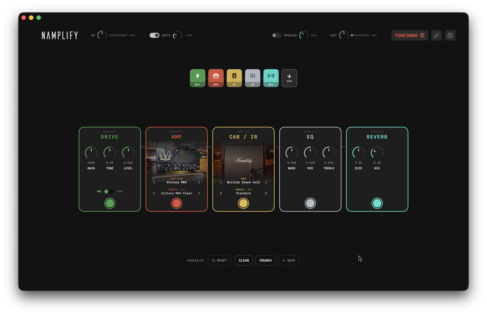

# NAMplify

**The simplest way to jam with NAM captures.**

**The simplest way to jam with NAM captures.** NAMplify wires [TONE3000](https://www.tone3000.com) straight into a pedalboard: amps, pedals and IRs sort themselves into the right stompbox — organized in banks you flip through like channels, with presets right on the pedal. Your whole rig on one screen, every sound one click away.

No importing, no folders, no menu diving. No DAW, no plugin host, no routing. Just play.

Comes with essential effects, tuner and drum machine.

## What is NAM?

[NAM (Neural Amp Modeler)](https://www.neuralampmodeler.com) is a free, open-source technology for creating digital models of real guitar amplifiers. A test signal is played through the real amp and a neural network learns how the amp responds. The result is a small file — a "capture" — that reproduces the amp's sound and feel, including how it reacts to picking dynamics and the guitar's volume knob. This is what sets NAM apart from conventional static amp simulations.

Captures exist in two generations: **A1** (WaveNet/LSTM — the majority on TONE3000 today) and **A2** (the newer, more accurate architecture). NAMplify plays both, in every size from *standard* down to *nano*. The TONE3000 community has shared thousands of them for free: vintage combos, modern high-gain heads, rare boutique gear.

## Get started

**[⬇ Download NAMplify.dmg](../../releases/latest)**

1. Open the downloaded file and drag **NAMplify** into your **Applications** folder
2. First start: **right-click the app → Open**
3. macOS will warn that the app "can't be verified". The app is safe — it is simply not registered with Apple's paid developer program (it's a free independent project).
   - If the warning has no "Open" button: **System Settings → Privacy & Security**, scroll down, click **"Open Anyway"**. Needed once.
4. Allow microphone/audio access when macOS asks — that's how the app hears your guitar
5. Click the gear (⚙️) and pick your audio interface
6. Click **Connect TONE3000**, sign in (free), download an amp — play

> You need an audio interface to connect your guitar to the Mac (iRig, Focusrite Scarlett or similar).

## What's inside

The pedalboard essentials: compressor, drive (two voicings + tone), EQ, chorus, phaser, tremolo, delay and reverb — around the NAM amp and a cab (IR) slot. Everything works, drag to reorder, remove what you don't need.

**Capture pedals:** NAM isn't just amps. Pedal captures (overdrives, fuzzes) get their own green PEDAL slot in front of the amp, outboard gear (preamps, spring reverb tanks) a violet OUTBOARD slot after the cab — each with its own NAM engine (outboard is still experimental).

**Top bar:** input gain with meter, noise gate, stereo SPREAD (Haas widener) and output level — always in reach, off the board.

Downloads are bundled into banks — one per tone, with all its variants — and sorted strictly by category (amps, pedals, outboard, IRs), each into its own list. Click a pedal's PRESETS row for a variant dropdown right on the pedal.

Stompbox-style tuner (mutes the output), drum machine and presets included.

> **Status:** early version. Known issue: switching audio devices inside the app can be unreliable — set input/output in **macOS System Settings → Sound** first, then launch NAMplify. Tested with iRig and common USB interfaces.

## Support

NAMplify is free. If it saves you time or you just enjoy it, you can buy me a coffee:

**[☕ Donate via PayPal](https://paypal.me/martinhentze/3EUR)**

## Credits

NAMplify is **free to download and use**.

Built on:

- **[NeuralAmpModelerCore](https://github.com/sdatkinson/NeuralAmpModelerCore)** © Steven Atkinson — the amp-modeling engine (MIT)
- **[Eigen](https://eigen.tuxfamily.org)** — math library (MPL2)
- **[nlohmann/json](https://github.com/nlohmann/json)** — JSON library (MIT)
- **[Silkscreen](https://kottke.org/plus/type/silkscreen/)** by Jason Kottke — pixel font (SIL Open Font License 1.1)

NAMplify is an independent app. It is **not affiliated with or endorsed by** the Neural Amp Modeler project, Steven Atkinson, or TONE3000. All captures are created and shared by the TONE3000 community under that platform's terms.
