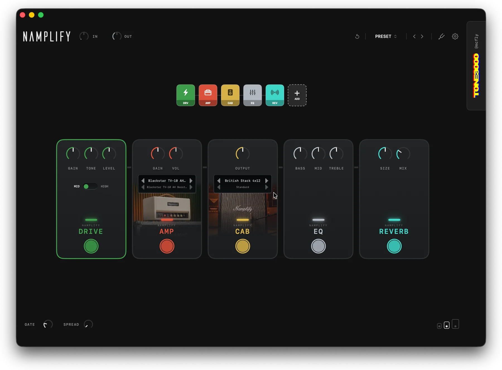
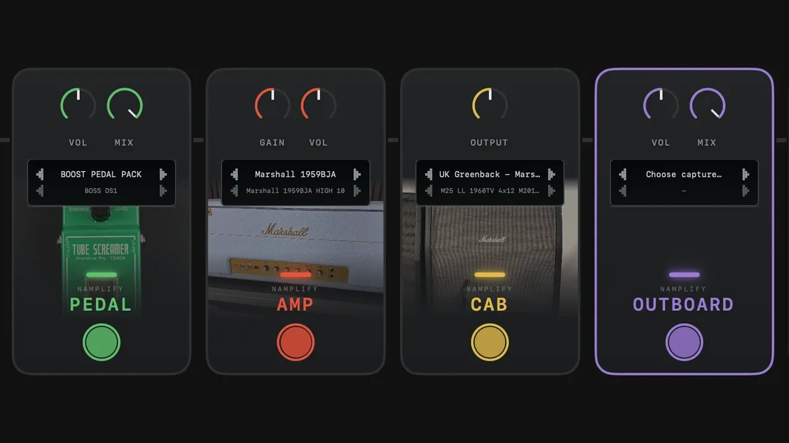
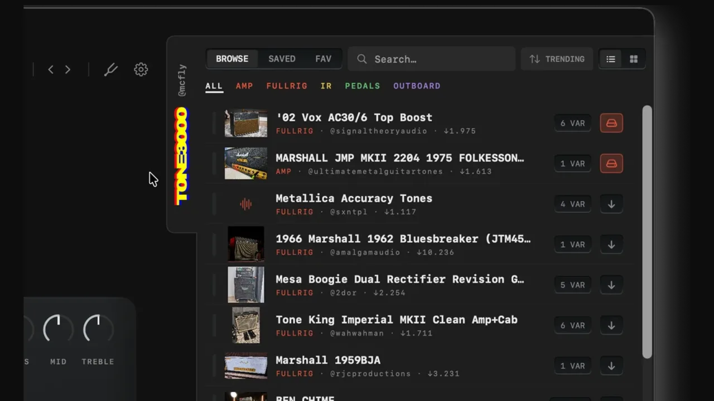
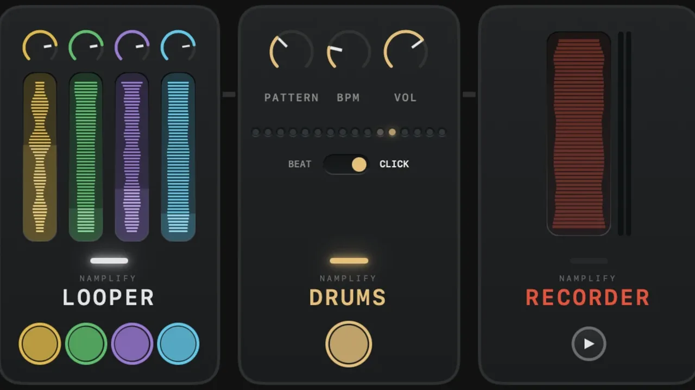
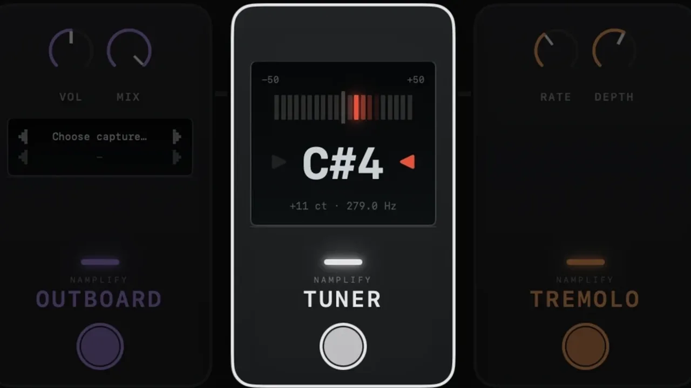
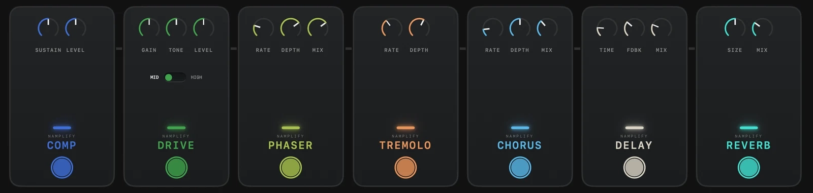

# NAMplify

**NAM, made simple.** · **www.namplify.app**

## Amplify the amp. Simplify the rest.

That's the name, and that's the whole idea. Getting NAM captures into something
is easy, lots of things do that. What I was after is the bit that comes after.

So everything sits on one board. Drag the pedals into whatever order you want.
Spin the wheel on the amp and walk through a whole bank of them while you keep
playing. Hit the looper and jam over yourself.

You don't set anything up first. Load a full rig and the cab gets out of the
way. Load a bare amp and it brings a cab along. Find something in the
[TONE3000](https://www.tone3000.com) browser and you're already hearing it.
No import, no file to go looking for.

It's a free virtual pedalboard for macOS, built for picking the guitar up for
twenty minutes. Not for running a session.

**[⬇ Download the latest release](https://github.com/Roccccky/NAMplify/releases/latest)** — macOS 13+ · Apple Silicon & Intel

*Mac only for now — Windows, VST3 and AU builds are on the way. So folks, hang in there.*

---

<table>
<tr>
<td width="50%" valign="top">

 <b>Four slots take NAM captures.</b> Pedal, amp, cab, outboard. Each has its own engine.
</td>
<td width="50%" valign="top">

 <b>TONE3000, inside the app.</b> Browse, favourite and download without leaving NAMplify.
</td>
</tr>
<tr>
<td width="50%" valign="top">

 <b>Looper, drums, recorder.</b> Four tracks, patterns, and WAVs written straight to disk.
</td>
<td width="50%" valign="top">

 <b>A tuner.</b> Stomp it, tune, stomp back.
</td>
</tr>
</table>

**And a normal board around them.** Compressor, drive, phaser, tremolo, chorus, delay,
reverb, plus EQ. Drag to reorder, right-click to remove, `+` to add.

---

## What's on the board

**Four slots take NAM captures.** `PEDAL` for overdrives, fuzzes and boosts in front of the
amp. `AMP` for amp captures and full rigs. `CAB` for IRs, and if you load an amp without one
NAMplify pairs a cab itself. `OUTBOARD` for preamps and studio gear after the cab, still
experimental. Each slot has its own NAM engine.

**Around them, a normal board.** Compressor, drive (two voicings plus tone), EQ, chorus,
phaser, tremolo, delay and reverb. Drag to reorder, right-click to remove, `+` to add.

**Tools.** Stompbox tuner, drum machine, four-track looper, and a recorder that writes WAVs.

**Top bar.** Input gain with meter, noise gate, stereo SPREAD and output level, always in
reach.

**Banks and presets.** Downloads bundle into banks you flip through like channels, and the
dial on the pedal steps through the variants. Save a whole rig as a preset and export it as
a `.nampset`.

## Get started

> You need an audio interface to get the guitar into the Mac (iRig, Focusrite Scarlett or similar).

1. Open the DMG and drag **NAMplify** into your **Applications** folder
2. First launch: **right-click the app → Open**, then **Open Anyway**
3. Allow **microphone access** so the app can hear your guitar
4. Pick your audio interface in the settings (⚙️), then **Connect TONE3000**, sign in free and pull down an amp

<b>"NAMplify can't be verified" &mdash; what that means</b>

 

macOS shows this for any app that isn't enrolled in Apple's paid developer
programme. It's not a warning about the app's contents. It just means nobody bought a
certificate.

Right-click the app and choose **Open**, then **Open Anyway**. On newer macOS
the button sits in **System Settings → Privacy & Security**, right after the
first attempt. You only need to do this once.

## Privacy

NAMplify talks to exactly two addresses: `tone3000.com` when you browse or download captures,
and in the shipped 0.5.x builds an update check once a day. **No analytics, no telemetry, no
crash reporting.** There's no account with me and nothing running in the background. Your
playing, your recordings and your models never leave the Mac.

## Credits

NAMplify models nothing itself. The captures are the work of the NAM project and of the
people who make and share them, and they reach the app through the **TONE3000 API**, which
is what makes a library this size usable from inside a program at all. Without those two
there'd be nothing to plug in. NAMplify is just the board you play them on.

It is **free to download and use**. Built on:

- **NeuralAmpModelerCore** © Steven Atkinson — the amp-modeling engine (MIT)
- **[Eigen](https://eigen.tuxfamily.org)** — math library (MPL2)
- **nlohmann/json** — JSON library (MIT)

Their licence notices ship inside the app.

If it saves you time, you can [buy me a coffee](https://paypal.me/martinhentze/3EUR). It stays free either way.

NAMplify is an independent app. Not affiliated with, endorsed or certified by TONE3000
(Hot, Inc.), the Neural Amp Modeler project or Steven Atkinson. All captures are created
and shared by the TONE3000 community and are downloaded through the TONE3000 API under
that platform's terms.
